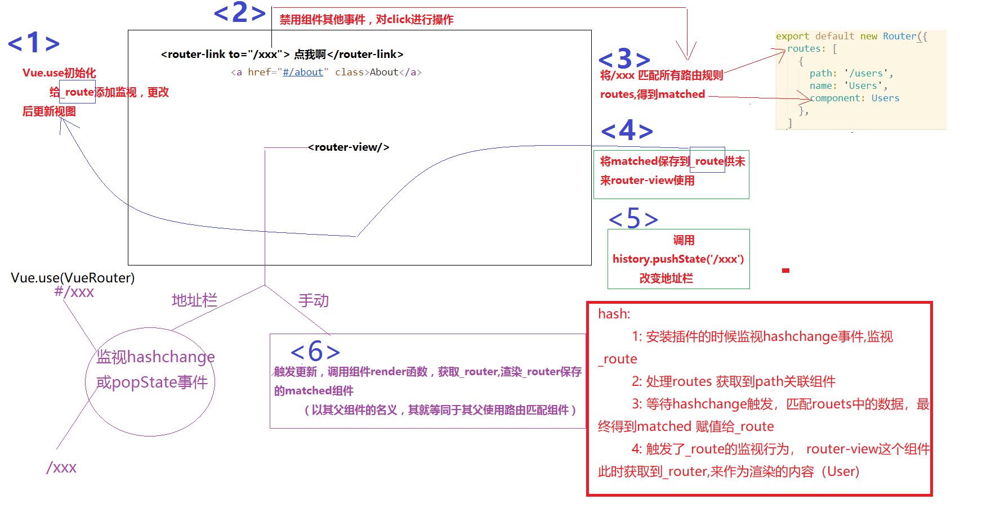
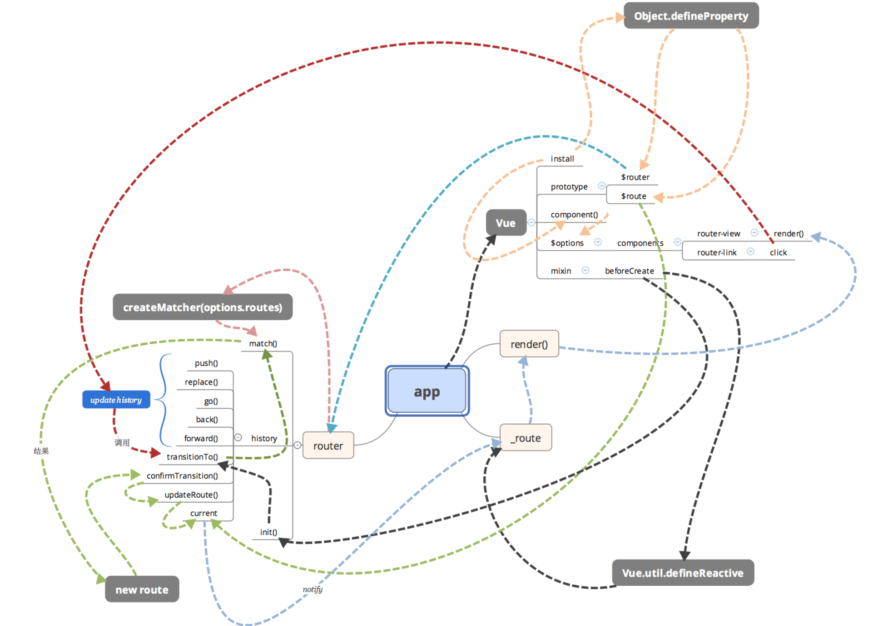
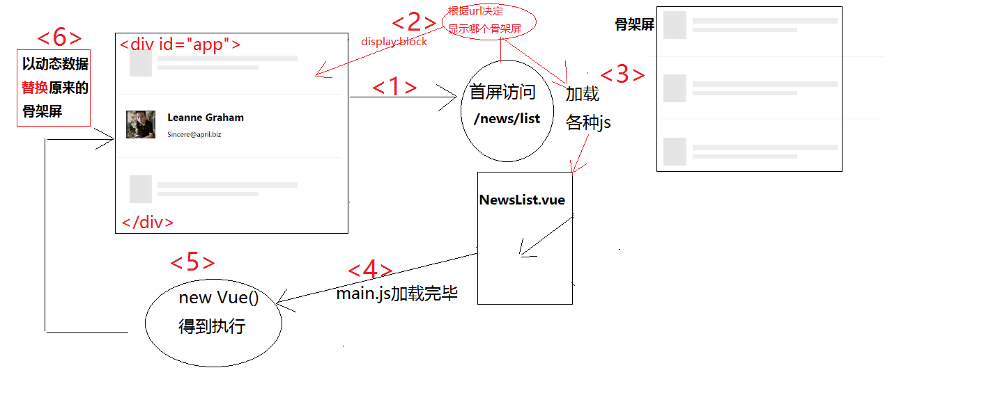
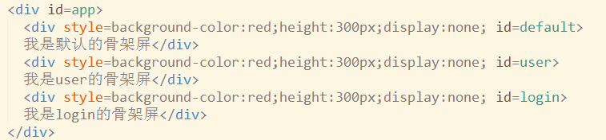
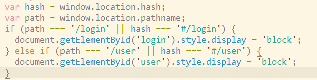
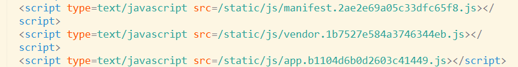
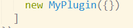
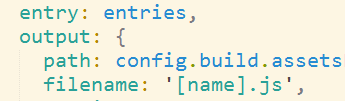

#### history模式

* 如果不希望看到丑陋的 # 可以使用history模式 ， 其原理依赖于 history.pushState函数
  * a标签点击以后，如果没有# 必然会页面跳转发起请求
  * 使用pushState函数可以改变url     比如  /abc 而不会发起请求
  * js通过location.pathname获取该值 /abc  做页面局部的替换
* router-view的history简单实现原理
  * 
* router-view实现图解
  * 


#### 自制webpack插件实现骨架屏

* 
* 原理分析：
  * 1: 从路由A跳到路由B慢不慢？  你敢说慢？ 因为A的时候各种js已经加载好了ok
  * 2: 那到底是什么比较慢 ？ A的首次加载
    * 慢会带来什么？
      * 1: 首屏白屏(量太大，渲染好久)
      * 2: 首屏卡顿(加载一半，一半卡住)
    * 解决方案：
      * 1: 客户端太慢，渲染容易卡住。。 服务端渲染好页面，客户端就加载个html完事
      * 2: 白屏也不错，但是如果能有个骨架屏，看起就爽了
* 插件实现思路
  * 
  * 需要在vue的执行代码加载之前，先让用户看到骨架屏，带app代码执行 new Vue() 替换<div id="app"></div> 就好了
  * 决定加载什么js的是index.html,操作他的插件是html-webpack-plugin
  * 我们让自己的插件再其后操作，并根据其留下的数据入口获取数据并更改
* 效果预览
  * html
    * 
  *  后续逻辑
    * 
  * 再来卡顿
    * 


* 插件代码

  * ```js
    let MyPlugin = function (options) {
      this.template = options.template;
    }
    
    MyPlugin.prototype.apply = function (compiler) {
      // console.log(compiler);
      console.log('我们的插件被执行了');
      // 先指定自己怎么编译，根据别人的编译结果操作
      compiler.plugin('compilation', compilation => {
          
          compilation.assets['./tjx.txt'] = {
              size:function () {
                  return 'abc'.length;
              },
              source:function () {
                return 'abc'
              }
            }
          
          
          	// 别人编译的入口
              compilation.plugin('html-webpack-plugin-before-html-processing',(htmlData,callback) => {
                  // html-webpack-plugin中间插入行为的地方
                  htmlData.html = htmlData.html.replace(`<div id="app"></div>`,`
                    <div id="app">
                      <div style="background-color:red;height:300px;display:none;" id="default" >
                          我是默认的骨架屏
                      </div>
                      <div style="background-color:red;height:300px;display:none;" id="user" >
                          我是user的骨架屏
                      </div>
                      <div style="background-color:red;height:300px;display:none;" id="login" >
                          我是login的骨架屏
                      </div>
                    </div>
                    <script>
                          var hash = window.location.hash;
                          var path = window.location.pathname;
                          if (path === '/login' || hash === '#/login') {
                            document.getElementById('login').style.display = 'block';
                          } else if (path === '/user' || hash === '#/user') {
                            document.getElementById('user').style.display = 'block';
                          }
                    </script>
                    `);
                  // 不论如何两个参数，错误在前
                  callback(null,htmlData);
    
              });
    
      });
    }
    module.exports = MyPlugin;
    ```

  * 使用插件（接着html插件）

    * 


#### 多页应用

* 核心思想: 其实就是两个vue项目，一次webpack打包，关联用url联系
  * webpack操作:
    * 1. 多个入口 {  main1:'./usermain.js',main2:'./goodsmain.js'  }
      2. 多个html插件
* 注意事项
  * 
* getHtmls的思路
  * 更为灵活的读取各项目下的js文件（入口）  entry:{‘js文件名’:'js文件路径' } 
  * 更为灵活的读取各项目下的html文件（首页.html） ``` plugins:[].concat(   [   new HtmlWebpackPlugin(),new HtmlWebpackPlugin()    ]    )```
    * filename属性是生成的相对dist的文件名  xxx.html
    * template 模板生成的参照物  需要绝对路径||相对路径 './xxx.html'
    * chunks:[filename]   指定第三引入的js文件名称
    * 
      * 这个[name]其实就是entry的key

