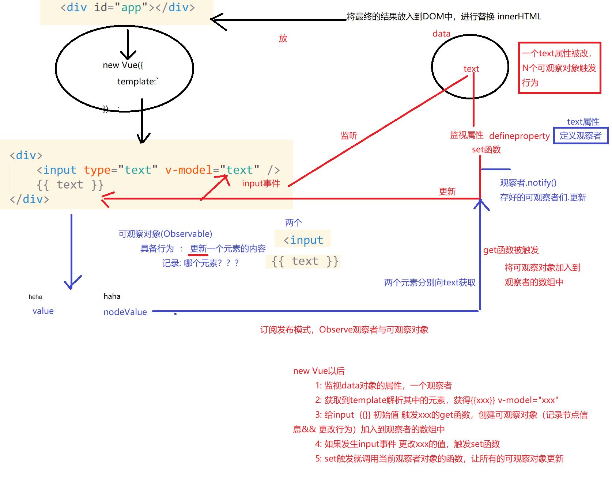

#### nuxt.js(SSR Server Site Render)

---

* 服务端渲染: 根据请求的URL ，动态的将模板与数据结合，并响应给客户端
* 简而言之，Nuxt.js是帮助Vue.js轻松完成服务端渲染工作的框架。Nuxt.js预设了服务端渲染所需要的各种配置，如异步数据，中间件，路由。
* 三大框架全家桶中的一部分（服务端渲染）它好比是 [Angular Universal](https://universal.angular.io/) 之于 [Angular](https://angular.io/)， [Next.js](https://zeit.co/blog/next2) 之于 [React](https://facebook.github.io/react/)。Vue的SSR是 nuxt
* 解决SEO的问题 ,   当百度搜索引擎爬虫爬取的时候  通过URL  产生对服务器的请求，服务器根据URL，响应页面，因此百度就获取到了我们站点的数据

* 前言：nuxt 前端路由沿用了history模式，通过history.pushState 更改url，进而局部渲染组件
* 而首屏刷新的时候，通过后端计算并模板渲染，再将html相应给客户端，一定程度解决了首屏白屏的问题


#### 总结

* 刷新，地址栏回车=> URL改变，服务端渲染
* 点击nuxt-link组件，点击a标签，禁止a标签的页面跳转，并根据其href属性，通过history.pushState改变地址栏，并发起请求或者具体的客户端渲染行为，局部替换内容

#### 目录结构


#### 运行流程


#### 脚手架

* ``` vue init nuxt-community/starter-template <project-name>```

#### 整体预览

* __vue前端渲染照旧(history)__
* 后端渲染补充
  * asyncData(context):  函数需要return {} ；  该数据会与组件内的data结合，在后端渲染组件前被调用
  * fetch(context):  在组件被创建前调用，用来同步Vuex内store数据
  * context属性
    * 

#### 便捷使用axios

* ## Install

  ```cmd
  $ npm i -S @nuxtjs/axios @nuxtjs/proxy
  ```

  ## Nuxt.config.js

  ```js
  {
    modules: [
      '@nuxtjs/axios',
      '@nuxtjs/proxy'
    ],
    proxy: [
      ['/api/dog', { target: 'https://dog.ceo/', pathRewrite: { '^/api/dog': '/api/breeds/image/random' } }]
    ]
  }
  ```

  ### Use Axios

  ```js
  // 服务端
  async asyncData({ app }) {
    const ip = await app.$axios.$get('http://icanhazip.com')
    return { ip }
  }
  // 客户端
  created() {
  	this.$axios.get('url');
  }
  ```


#### 关于部署


* 1. ```npm run build ```
  2. ```cd .nuxt/dist```
  3. 配置package.json文件  scripts ,添加一项 ```start-spa: "nuxt start --spa"```
  4. 服务端渲染: ```npm run start``` (run可以省略)
  5. 单页应用:  ```npm run start-spa```


#### 路由

* 


* 有动态参数的   在组件中使用 { params } 获去


